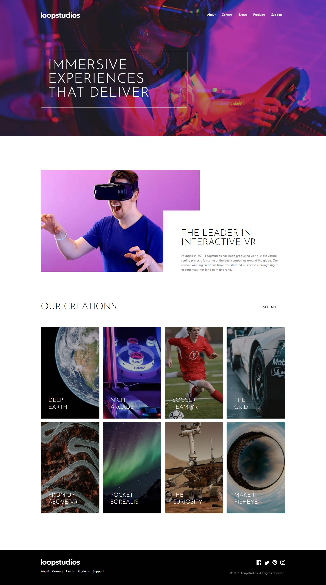

# Frontend Mentor - Loopstudios landing page solution

This is a solution to the [Loopstudios landing page challenge on Frontend Mentor](https://www.frontendmentor.io/challenges/loopstudios-landing-page-N88J5Onjw). Frontend Mentor challenges help you improve your coding skills by building realistic projects.

## Table of contents

- [Overview](#overview)
  - [The challenge](#the-challenge)
  - [Screenshot](#screenshot)
  - [Links](#links)
- [My process](#my-process)
  - [Built with](#built-with)
  - [What I learned](#what-i-learned)
  - [Continued development](#continued-development)
- [Author](#author)

## Overview

### The challenge

Users should be able to:

- View the optimal layout for the site depending on their device's screen size
- See hover states for all interactive elements on the page

### Screenshot

### Links

- Solution URL: [https://github.com/GoodnessObi/loopstudios](https://github.com/GoodnessObi/loopstudios)
- Live Site URL: [https://loopstudios-vert.vercel.app/](https://loopstudios-vert.vercel.app/)

## My process

### Built with

- Semantic HTML5 markup
- CSS custom properties
- Flexbox
- Mobile-first workflow
- [Typescript](https://www.typescriptlang.org/docs/)
- [React](https://reactjs.org/) - JS library
- [Next.js](https://nextjs.org/) - React framework
- [Tailwind](https://tailwindui.com/) - For styles

## Author

- Frontend Mentor - [@GoodnessObi](https://www.frontendmentor.io/profile/GoodnessObi)
- LinkedIn - [Goodness Obi](https://www.linkedin.com/in/goodnessobi/)
